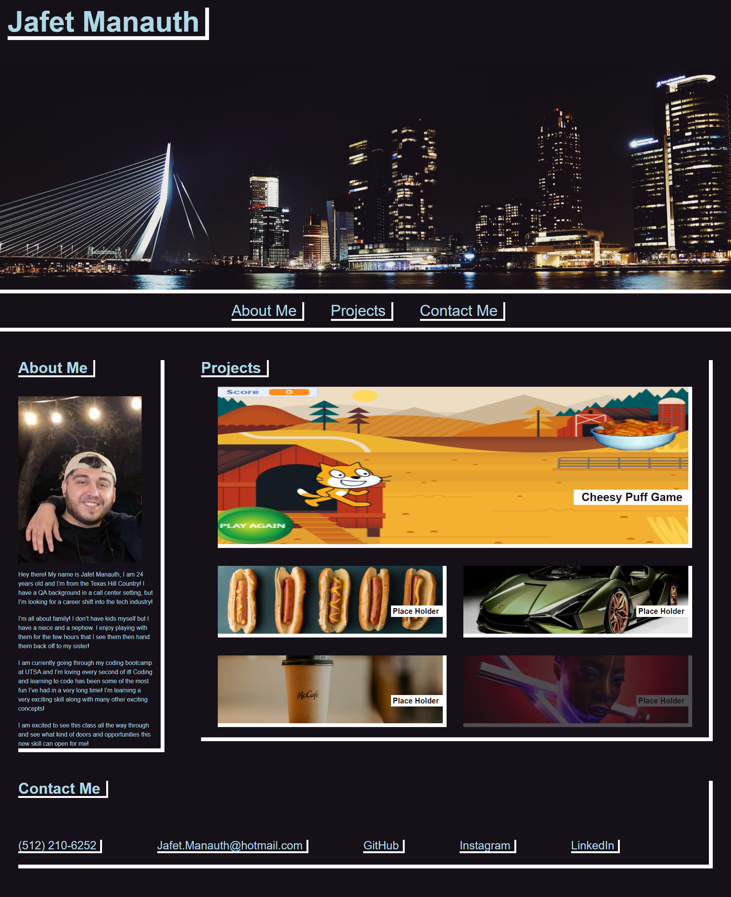

# JafetManauth-Portfolio

The purpose of this project was to create a functioning professional portfolio.
I was able to create an orginal design from scratch using all of the things I've learned in class so far. I was able to apply flex boxes in many areas of this project, which was an area I was most struggling in! 

Application Link: https://jmanauth.github.io/JafetManauth-Portfolio/